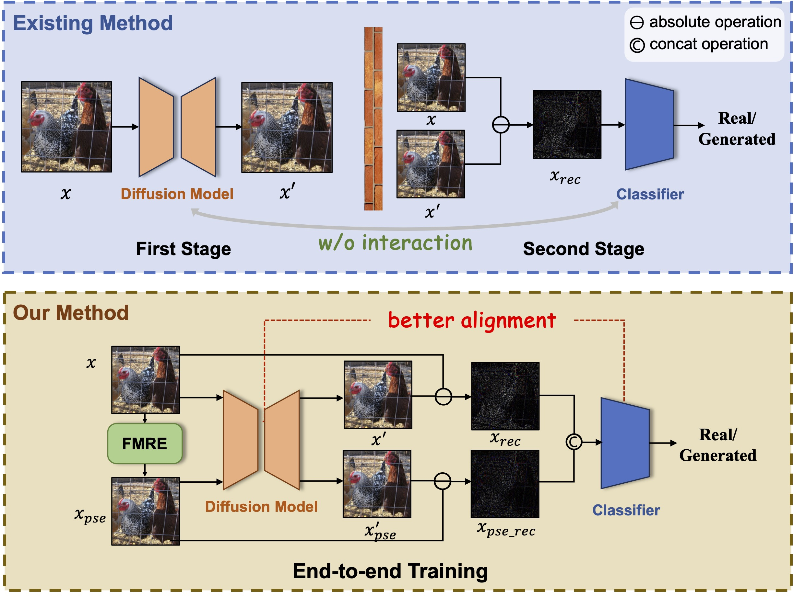

<h1 align="center">🔥FIRE: Robust Detection of Diffusion-Generated Images via Frequency-Guided
Reconstruction Error </h1>
<p align="center">
    <a href="https://arxiv.org/abs/2412.07140">
        
    </a>
    <a href="https://github.com/mengyougithub/FinBERT2-Suits/blob/master/LICENSE">
        
    </a>

<h4 align="center">
    <p>
        <a href="#Project Overview">Project Overview</a> |
        <a href="Reproduction Steps">Reproduction Steps</a> |
        <a href=#快速开始>快速开始</a> |
        <a href="#模型列表">模型列表</a> |
        <a href="#Reference">Reference</a> |
        <a href="#citation">Citation</a> |
        <a href="#license">License</a> 
    <p>
</h4>

<p align="center">

</p>

- [ ] [TBD] Release pre-trained models.
- [x] ~[2025/02/27] Release code.~
- [x] ~[2025/02/27] Accepted by CVPR 2025.~
- [x] ~[2024/12/10] Release paper.~


## <a id="Project Overview"></a>Project Overview

### `ckpt/`

- Stores checkpoints of models.

### `data/`

- DiffusionForensics and self-collected dataset.

### `utils/`

- Helper functions for data preprocessing, metrics, and model initialization.
    - `augment.py`: Includes weak and strong augmentation strategies.
    - `metrics.py`: Metrics to evaluate performance.
    - `network_utils.py`: Initializes FIRE.

### `dataset.py`

- Loads datasets.

### `train.py`

- Trains the FIRE model.

### `eval.py`

- Tests the FIRE model.

## Reproduction Steps
### 1. Data preparation

Downloads DiffusionForensics [[DIRE ICCV 2023]([https://www.example.com](https://github.com/ZhendongWang6/DIRE))] and our self-collected dataset and put them in `data/`. The datasets are organized as follows:

```bash
data/DiffusionForensics/
└── train/test
    ├── imagenet
    │   ├── real
    │   │   └──img0.png...
    │   ├── adm
    │   │   └──img0.png...
    │   ├── ...
    └── lsun_bedroom
        ├── real
        │   └──img0.png...
        ├── adm
        │   └──img0.png...
        ├── ...


data/fake-inversion/
└── train/test
    ├──  dalle3
    │    ├── 0_real
    │    │   └──img0.png...
    │    └── 1_fake
    │        └──img0.png...
    ├── kandinsky3
    │    ├── 0_real
    │    │   └──img0.png...
    │    └── 1_fake
    │        └──img0.png...
    ├──  midjourney
    │    ...
    ├──  sdxl
    │    ...
    └──  vega
         ...
```

### 2. Setup

```bash
pip install -r requirements.txt
```

### 3. **Training**

Then, to train the FIRE model, please run:

```bash
# train on DiffusionForensics
./train_df.sh

# train on self-collected dataset
./train_fi.sh
```

### 4. **Evaluation**

To evaluate the FIRE model, please run:

```bash
# test on DiffusionForensics
./test_df.sh
# test on self-collected dataset
./test_fi.sh
```


## File Structure
```shell
.
├── dataset  # * dataset path

└── model  # * 
    ├── 

```

## 更新
- 12/15/2024：创建github项目
                             |

## Reference:
我们的套件基于下列开源项目开发，关于更多细节，可以参考原仓库：

1、FlagEmbedding(https://github.com/FlagOpen/FlagEmbedding): 是一个开源项目,旨在开发检索和检索增强的语言模型。

2、SentencePiece (https://github.com/google/sentencepiece): Google开发的无监督文本分词器,用于基于神经网络的文本生成任务。

3、RoBERTa中文预训练模型 (https://github.com/brightmart/roberta_zh): 一个采用RoBERTa方法在大规模中文语料上进行预训练的中文语言模型。

4、BERTopic (https://github.com/MaartenGr/BERTopic): 利用BERT和类TF-IDF来创建可解释的主题模型。

5、FinBERT (https://github.com/valuesimplex/FinBERT): 熵简科技第一代FinBER

## Citation

如果您觉得我们的工作有所帮助，请考虑点个星 :star: 和引用以下论文:
```
@misc{
}
```
## License
Based on [MIT License](LICENSE) open source license.
